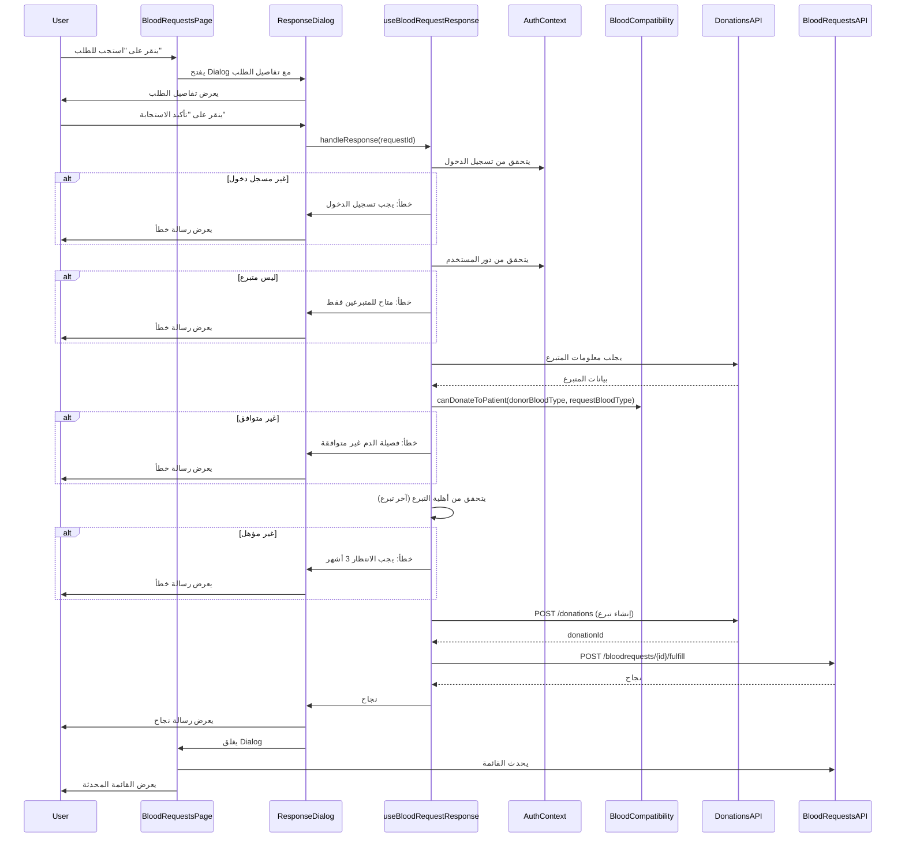

# مستند التصميم - ميزة الاستجابة لطلبات الدم

## نظرة عامة (Overview)

### الهدف

تصميم وتنفيذ ميزة الاستجابة لطلبات الدم في نظام BloodConnect، والتي تمكّن المتبرعين المسجلين من الاستجابة لطلبات الدم المعروضة في صفحة BloodRequests. تهدف هذه الميزة إلى:

- ربط المتبرعين بطلبات الدم المناسبة بناءً على توافق فصيلة الدم
- التحقق من أهلية المتبرع للتبرع بناءً على تاريخ آخر تبرع
- تسجيل الاستجابات في النظام وربطها بطلبات الدم
- تحديث حالة الطلبات تلقائياً عند الاستجابة
- توفير تجربة مستخدم سلسة وواضحة

### السياق

الصفحة الحالية `src/pages/BloodRequests.tsx` تعرض قائمة بطلبات الدم مع زر "استجب للطلب"، لكن الوظيفة غير مكتملة. يوجد dialog بسيط يعرض رسالة تأكيد فقط دون تنفيذ فعلي. هذا التصميم يوفر الحل الكامل لتنفيذ هذه الميزة.

### النطاق

يشمل هذا التصميم:
- تصميم واجهة المستخدم (UI) للـ Response Dialog
- تدفق البيانات من الواجهة إلى API الخلفي
- منطق التحقق من الأهلية والتوافق
- معالجة الأخطاء والحالات الاستثنائية
- تحديث واجهة المستخدم بعد الاستجابة

لا يشمل:
- تعديلات على API الخلفي (نفترض أن جميع endpoints موجودة)
- تصميم صفحة BloodRequests الأساسية (موجودة بالفعل)
- نظام الإشعارات (خارج نطاق هذه الميزة)

## المعمارية (Architecture)

### نمط المعمارية

تتبع الميزة نمط **Component-Based Architecture** مع **Unidirectional Data Flow**:

```
User Action → Component State → API Call → Backend → Response → State Update → UI Update
```

### المكونات الرئيسية

1. **BloodRequests Page Component** (`src/pages/BloodRequests.tsx`)
   - المكون الرئيسي الذي يعرض قائمة الطلبات
   - يدير حالة Dialog الاستجابة
   - يتعامل مع تحديث القائمة بعد الاستجابة

2. **ResponseDialog Component** (مكون جديد)
   - نافذة منبثقة لتأكيد الاستجابة
   - يعرض تفاصيل الطلب
   - يدير حالة التحميل والأخطاء

3. **useBloodRequestResponse Hook** (hook جديد)
   - يحتوي على منطق الاستجابة للطلب
   - يتعامل مع التحقق من الأهلية والتوافق
   - يدير استدعاءات API

4. **Blood Compatibility Module** (`src/lib/bloodCompatibility.ts`)
   - موجود بالفعل
   - يوفر دالة `canDonateToPatient` للتحقق من التوافق

5. **API Clients** (`src/api/donations.ts`, `src/api/bloodRequests.ts`)
   - موجودة بالفعل
   - توفر endpoints للتبرعات وطلبات الدم

### تدفق البيانات (Data Flow)



### قرارات معمارية

1. **فصل المنطق عن العرض**: استخدام custom hook (`useBloodRequestResponse`) لفصل منطق الأعمال عن مكونات UI
   - **السبب**: تسهيل الاختبار وإعادة الاستخدام

2. **التحقق من الأهلية في Frontend**: إجراء التحققات الأولية في Frontend قبل إرسال الطلب
   - **السبب**: تحسين تجربة المستخدم بتوفير ردود فعل فورية
   - **ملاحظة**: Backend يجب أن يقوم بنفس التحققات للأمان

3. **استخدام Dialog من shadcn/ui**: استخدام مكون Dialog الموجود بدلاً من إنشاء modal مخصص
   - **السبب**: الاتساق مع بقية النظام وتوفير الوقت

4. **تحديث القائمة بعد الاستجابة**: إعادة جلب البيانات بدلاً من التحديث المحلي
   - **السبب**: ضمان تزامن البيانات مع Backend

## المكونات والواجهات (Components and Interfaces)

### 1. ResponseDialog Component

مكون جديد لعرض تفاصيل الطلب وتأكيد الاستجابة.

**الموقع**: `src/components/blood-requests/ResponseDialog.tsx`

**Props**:
```typescript
interface ResponseDialogProps {
  open: boolean;
  onOpenChange: (open: boolean) => void;
  request: BloodRequest | null;
  onSuccess: () => void;
}
```

**الحالة الداخلية**:
```typescript
interface ResponseDialogState {
  isSubmitting: boolean;
  error: string | null;
  showSuccess: boolean;
  donationId: number | null;
}
```

**الوظائف الرئيسية**:
- `handleConfirm()`: يتعامل مع تأكيد الاستجابة
- `handleClose()`: يغلق Dialog ويعيد تعيين الحالة
- `renderError()`: يعرض رسائل الخطأ
- `renderSuccess()`: يعرض رسالة النجاح

### 2. useBloodRequestResponse Hook

Hook مخصص يحتوي على منطق الاستجابة للطلب.

**الموقع**: `src/hooks/useBloodRequestResponse.ts`

**الواجهة**:
```typescript
interface UseBloodRequestResponseReturn {
  respondToRequest: (requestId: number, requestBloodTypeId: number, quantityNeeded: number) => Promise<RespondResult>;
  isLoading: boolean;
  error: string | null;
}

interface RespondResult {
  success: boolean;
  donationId?: number;
  error?: string;
  errorType?: 'auth' | 'compatibility' | 'eligibility' | 'api' | 'unknown';
}
```

**الوظائف الداخلية**:
- `checkAuthentication()`: يتحقق من تسجيل الدخول ودور المستخدم
- `checkBloodCompatibility()`: يتحقق من توافق فصيلة الدم
- `checkDonationEligibility()`: يتحقق من أهلية التبرع
- `createDonation()`: ينشئ سجل تبرع جديد
- `fulfillRequest()`: يربط التبرع بالطلب

### 3. تحديثات على BloodRequests Page

**التعديلات المطلوبة**:
- استبدال Dialog الحالي بـ ResponseDialog الجديد
- إضافة معالج لتحديث القائمة بعد الاستجابة الناجحة
- تحسين معالجة الأخطاء

### 4. Donor Service (خدمة جديدة)

**الموقع**: `src/api/donors.ts` (تحديث)

**إضافة endpoint جديد**:
```typescript
getDonorByUserId: async (userId: number): Promise<ServiceResponse<Donor>>
```

هذا endpoint ضروري للحصول على معلومات المتبرع (بما في ذلك فصيلة الدم وآخر تبرع) بناءً على userId من AuthContext.

## نماذج البيانات (Data Models)

### نموذج الاستجابة للطلب

```typescript
interface DonationResponse {
  donorID: number;
  bloodTypeID: number;
  donationDate: string; // ISO 8601 format
  quantity: number;
  testResult: 0; // Pending
  notes: string; // "Response to request #{requestId}"
}
```

### نموذج ربط التبرع بالطلب

```typescript
interface FulfillRequestPayload {
  donationId: number;
  quantity: number;
}
```

### نموذج التحقق من الأهلية

```typescript
interface DonorEligibility {
  isEligible: boolean;
  lastDonationDate: Date | null;
  nextEligibleDate: Date | null;
  daysUntilEligible: number;
}
```

### نموذج التوافق الدموي

```typescript
interface BloodCompatibilityCheck {
  isCompatible: boolean;
  donorBloodType: string;
  requestBloodType: string;
  reason?: string; // في حالة عدم التوافق
}
```

## خصائص الصحة (Correctness Properties)

*الخاصية (Property) هي سمة أو سلوك يجب أن يكون صحيحاً عبر جميع عمليات التنفيذ الصالحة للنظام - بشكل أساسي، بيان رسمي حول ما يجب أن يفعله النظام. تعمل الخصائص كجسر بين المواصفات المقروءة للإنسان وضمانات الصحة القابلة للتحقق آلياً.*


### تحليل معايير القبول

بناءً على التحليل المسبق، تم تحديد الخصائص القابلة للاختبار من معايير القبول. تم دمج الخصائص المتشابهة لتجنب التكرار وضمان أن كل خاصية توفر قيمة تحقق فريدة.

### الخصائص القابلة للاختبار

#### الخاصية 1: عرض محتوى Dialog الكامل
*لأي* طلب دم صحيح، عند عرضه في Response Dialog، يجب أن يحتوي المحتوى المعروض على جميع المعلومات الأساسية: فصيلة الدم المطلوبة، الكمية بالوحدات، مستوى الاستعجال، وصف الطلب، ومعلومات المستشفى.

**يتحقق من المتطلبات: 1.2, 1.3, 1.4, 1.5, 1.6**

#### الخاصية 2: التحقق من المصادقة
*لأي* محاولة استجابة لطلب دم، يجب على النظام التحقق من وجود JWT Token صالح قبل السماح بالمتابعة.

**يتحقق من المتطلبات: 2.3**

#### الخاصية 3: التحقق من دور المستخدم
*لأي* مستخدم مسجل دخول يحاول الاستجابة لطلب، يجب على النظام التحقق من أن دور المستخدم هو "donor" قبل السماح بالاستجابة.

**يتحقق من المتطلبات: 3.1**

#### الخاصية 4: التحقق من توافق فصيلة الدم
*لأي* محاولة استجابة من متبرع، يجب على النظام التحقق من توافق فصيلة دم المتبرع مع فصيلة الدم المطلوبة باستخدام قواعد التوافق الدموي، ورفض الاستجابة إذا كانت غير متوافقة.

**يتحقق من المتطلبات: 4.1, 4.3**

#### الخاصية 5: محتوى رسالة خطأ التوافق
*لأي* محاولة استجابة مرفوضة بسبب عدم توافق فصيلة الدم، يجب أن تحتوي رسالة الخطأ على معلومات واضحة عن فصيلة دم المتبرع والفصيلة المطلوبة.

**يتحقق من المتطلبات: 4.5**

#### الخاصية 6: التحقق من أهلية التبرع
*لأي* محاولة استجابة من متبرع، يجب على النظام التحقق من أن آخر تبرع كان قبل 90 يوماً على الأقل، ورفض الاستجابة إذا كانت الفترة أقل من ذلك.

**يتحقق من المتطلبات: 5.1, 5.3**

#### الخاصية 7: محتوى رسالة خطأ الأهلية
*لأي* محاولة استجابة مرفوضة بسبب عدم الأهلية، يجب أن تحتوي رسالة الخطأ على تاريخ آخر تبرع والتاريخ المتوقع للأهلية التالية.

**يتحقق من المتطلبات: 5.4**

#### الخاصية 8: إنشاء سجل تبرع كامل
*لأي* استجابة ناجحة لطلب دم، يجب على النظام إنشاء سجل Donation يحتوي على جميع الحقول المطلوبة: معرف المتبرع (donorID)، معرف فصيلة الدم (bloodTypeID)، تاريخ التبرع (donationDate)، الكمية (quantity)، حالة الفحص Pending (testResult = 0)، وملاحظات تشير إلى معرف الطلب (notes).

**يتحقق من المتطلبات: 6.1, 6.2, 6.3, 6.4, 6.5, 6.6, 6.7**

#### الخاصية 9: ربط التبرع بالطلب
*لأي* سجل تبرع تم إنشاؤه بنجاح، يجب على النظام استدعاء fulfill endpoint لربط التبرع بالطلب المقابل.

**يتحقق من المتطلبات: 6.8**

#### الخاصية 10: عرض رسالة نجاح شاملة
*لأي* استجابة ناجحة، يجب على النظام عرض رسالة شكر تحتوي على معلومات عن الخطوات التالية ومعرف التبرع (donationId) كرقم مرجعي.

**يتحقق من المتطلبات: 8.1, 8.2, 8.3**

#### الخاصية 11: عرض رسالة خطأ عند الفشل
*لأي* محاولة استجابة فاشلة، يجب على النظام عرض رسالة خطأ واضحة تشرح سبب الفشل.

**يتحقق من المتطلبات: 8.4**

#### الخاصية 12: إغلاق Dialog بعد النجاح
*لأي* استجابة ناجحة، يجب على النظام إغلاق Response Dialog تلقائياً.

**يتحقق من المتطلبات: 9.1**

#### الخاصية 13: تحديث القائمة بعد النجاح
*لأي* استجابة ناجحة، يجب على النظام إعادة جلب قائمة طلبات الدم لعرض الحالة المحدثة.

**يتحقق من المتطلبات: 9.2, 9.4**

#### الخاصية 14: منع استدعاء fulfill عند فشل create
*لأي* محاولة إنشاء سجل تبرع فاشلة، يجب على النظام عدم محاولة استدعاء fulfill endpoint.

**يتحقق من المتطلبات: 10.2**

#### الخاصية 15: إيقاف حالة التحميل دائماً
*لأي* عملية استجابة (ناجحة أو فاشلة)، يجب على النظام إيقاف حالة التحميل (isSubmitting = false) لمنع ترك Dialog في حالة تحميل دائمة.

**يتحقق من المتطلبات: 10.6**

#### الخاصية 16: عرض مؤشر تحميل أثناء المعالجة
*لأي* عملية استجابة قيد التنفيذ، يجب على النظام عرض مؤشر تحميل واضح وتعطيل زر "تأكيد الاستجابة".

**يتحقق من المتطلبات: 11.2, 11.3**

#### الخاصية 17: تحويل بيانات المتبرع
*لأي* استجابة API صحيحة تحتوي على بيانات متبرع، يجب على Parser تحويل البيانات بنجاح إلى نموذج Donor مع التحقق من وجود جميع الحقول المطلوبة (donorId, bloodTypeId, lastDonationDate).

**يتحقق من المتطلبات: 12.1, 12.2**

#### الخاصية 18: تحويل تاريخ آخر تبرع
*لأي* بيانات متبرع تحتوي على lastDonationDate كـ string، يجب على Parser تحويلها إلى Date object بنجاح.

**يتحقق من المتطلبات: 12.3**

#### الخاصية 19: Round-trip لبيانات المتبرع
*لأي* بيانات متبرع صحيحة، عملية parsing ثم printing ثم parsing مرة أخرى يجب أن تنتج كائن مكافئ للكائن الأصلي.

**يتحقق من المتطلبات: 12.7**

## معالجة الأخطاء (Error Handling)

### أنواع الأخطاء

1. **أخطاء المصادقة (Authentication Errors)**
   - المستخدم غير مسجل دخول
   - Token منتهي الصلاحية
   - دور المستخدم غير صحيح

2. **أخطاء التحقق (Validation Errors)**
   - فصيلة الدم غير متوافقة
   - المتبرع غير مؤهل (آخر تبرع حديث)
   - بيانات الطلب غير صحيحة

3. **أخطاء API (API Errors)**
   - فشل الاتصال بالخادم
   - فشل إنشاء سجل التبرع
   - فشل ربط التبرع بالطلب
   - خطأ في الخادم (500)

4. **أخطاء البيانات (Data Errors)**
   - فشل parsing بيانات المتبرع
   - بيانات ناقصة من API
   - تنسيق تاريخ غير صحيح

### استراتيجية معالجة الأخطاء

```typescript
interface ErrorHandlingStrategy {
  errorType: 'auth' | 'validation' | 'api' | 'data' | 'unknown';
  userMessage: string; // رسالة للمستخدم بالعربية
  action: 'retry' | 'redirect' | 'dismiss' | 'contact';
  logLevel: 'error' | 'warn' | 'info';
}
```

### معالجة الأخطاء حسب النوع

#### 1. أخطاء المصادقة
```typescript
if (!user || !token) {
  return {
    errorType: 'auth',
    userMessage: 'يجب تسجيل الدخول للاستجابة لطلبات الدم',
    action: 'redirect', // توجيه لصفحة تسجيل الدخول
    logLevel: 'info'
  };
}

if (userRole !== 'donor') {
  return {
    errorType: 'auth',
    userMessage: 'هذه الميزة متاحة للمتبرعين فقط',
    action: 'dismiss',
    logLevel: 'info'
  };
}
```

#### 2. أخطاء التحقق
```typescript
if (!canDonateToPatient(donorBloodTypeId, requestBloodTypeId)) {
  return {
    errorType: 'validation',
    userMessage: `عذراً، فصيلة دمك (${donorBloodType}) غير متوافقة مع الفصيلة المطلوبة (${requestBloodType})`,
    action: 'dismiss',
    logLevel: 'info'
  };
}

if (daysUntilEligible > 0) {
  return {
    errorType: 'validation',
    userMessage: `عذراً، آخر تبرع لك كان في ${lastDonationDate}. يمكنك التبرع مرة أخرى في ${nextEligibleDate}`,
    action: 'dismiss',
    logLevel: 'info'
  };
}
```

#### 3. أخطاء API
```typescript
try {
  const response = await donationsApi.create(donationData);
  if (!response.success) {
    throw new Error(response.message || 'فشل إنشاء سجل التبرع');
  }
} catch (error) {
  if (error.message.includes('network') || error.message.includes('timeout')) {
    return {
      errorType: 'api',
      userMessage: 'فشل الاتصال بالخادم. يرجى التحقق من اتصالك بالإنترنت والمحاولة مرة أخرى',
      action: 'retry',
      logLevel: 'error'
    };
  }
  
  return {
    errorType: 'api',
    userMessage: 'حدث خطأ أثناء تسجيل الاستجابة. يرجى المحاولة مرة أخرى أو التواصل مع المستشفى',
    action: 'contact',
    logLevel: 'error'
  };
}
```

#### 4. أخطاء البيانات
```typescript
try {
  const donor = parseDonorData(apiResponse.data);
  if (!donor.donorId || !donor.bloodTypeId) {
    throw new Error('بيانات المتبرع ناقصة');
  }
} catch (error) {
  console.error('Error parsing donor data:', error);
  return {
    errorType: 'data',
    userMessage: 'حدث خطأ في تحميل بيانات المتبرع. يرجى المحاولة مرة أخرى',
    action: 'retry',
    logLevel: 'error'
  };
}
```

### مبادئ معالجة الأخطاء

1. **الوضوح**: رسائل الخطأ يجب أن تكون واضحة ومفهومة للمستخدم
2. **الإرشاد**: توفير خطوات واضحة للمستخدم لحل المشكلة
3. **التسجيل**: تسجيل جميع الأخطاء في console للمطورين
4. **التعافي**: محاولة التعافي من الأخطاء عندما يكون ممكناً
5. **عدم الحظر**: عدم ترك UI في حالة محظورة (مثل loading دائم)

### مثال على معالج أخطاء شامل

```typescript
const handleError = (error: Error, context: string): ErrorHandlingStrategy => {
  console.error(`Error in ${context}:`, error);
  
  // تحديد نوع الخطأ
  if (error.message.includes('authentication') || error.message.includes('token')) {
    return {
      errorType: 'auth',
      userMessage: 'انتهت جلستك. يرجى تسجيل الدخول مرة أخرى',
      action: 'redirect',
      logLevel: 'warn'
    };
  }
  
  if (error.message.includes('network') || error.message.includes('fetch')) {
    return {
      errorType: 'api',
      userMessage: 'فشل الاتصال بالخادم. يرجى المحاولة مرة أخرى',
      action: 'retry',
      logLevel: 'error'
    };
  }
  
  // خطأ عام
  return {
    errorType: 'unknown',
    userMessage: 'حدث خطأ غير متوقع. يرجى المحاولة مرة أخرى أو التواصل مع الدعم الفني',
    action: 'contact',
    logLevel: 'error'
  };
};
```

## استراتيجية الاختبار (Testing Strategy)

### نهج الاختبار المزدوج

تتبع هذه الميزة نهج اختبار مزدوج يجمع بين:

1. **اختبارات الوحدة (Unit Tests)**: للتحقق من أمثلة محددة وحالات حافة وشروط الخطأ
2. **اختبارات الخصائص (Property-Based Tests)**: للتحقق من الخصائص العامة عبر جميع المدخلات

كلا النوعين ضروري ومكمل للآخر:
- اختبارات الوحدة تكشف عن أخطاء محددة في حالات معروفة
- اختبارات الخصائص تتحقق من الصحة العامة عبر مدخلات عشوائية متنوعة

### مكتبة اختبار الخصائص

سنستخدم **fast-check** لاختبارات الخصائص في TypeScript/JavaScript:

```bash
npm install --save-dev fast-check @types/fast-check
```

### تكوين اختبارات الخصائص

- **عدد التكرارات**: 100 تكرار كحد أدنى لكل اختبار خاصية
- **التوسيم**: كل اختبار خاصية يجب أن يحتوي على تعليق يشير إلى الخاصية في مستند التصميم
- **التنسيق**: `// Feature: blood-request-response, Property {number}: {property_text}`

### أمثلة على اختبارات الخصائص

#### مثال 1: اختبار توافق فصيلة الدم (الخاصية 4)

```typescript
import fc from 'fast-check';
import { canDonateToPatient } from '@/lib/bloodCompatibility';

describe('Blood Compatibility', () => {
  // Feature: blood-request-response, Property 4: التحقق من توافق فصيلة الدم
  it('should reject incompatible blood types for all donor-request pairs', () => {
    fc.assert(
      fc.property(
        fc.integer({ min: 1, max: 8 }), // donorBloodTypeId
        fc.integer({ min: 1, max: 8 }), // requestBloodTypeId
        (donorBloodTypeId, requestBloodTypeId) => {
          const isCompatible = canDonateToPatient(donorBloodTypeId, requestBloodTypeId);
          
          // إذا كانت غير متوافقة، يجب رفض الاستجابة
          if (!isCompatible) {
            // هنا نتحقق من أن النظام يرفض الاستجابة
            // في الاختبار الفعلي، سنستدعي الدالة ونتحقق من النتيجة
            expect(isCompatible).toBe(false);
          }
          
          return true;
        }
      ),
      { numRuns: 100 }
    );
  });
});
```

#### مثال 2: اختبار أهلية التبرع (الخاصية 6)

```typescript
// Feature: blood-request-response, Property 6: التحقق من أهلية التبرع
it('should reject donations within 90 days of last donation', () => {
  fc.assert(
    fc.property(
      fc.date({ min: new Date('2020-01-01'), max: new Date() }), // lastDonationDate
      (lastDonationDate) => {
        const today = new Date();
        const daysSinceLastDonation = Math.floor(
          (today.getTime() - lastDonationDate.getTime()) / (1000 * 60 * 60 * 24)
        );
        
        const isEligible = daysSinceLastDonation >= 90;
        
        // إذا كان أقل من 90 يوم، يجب رفض الاستجابة
        if (daysSinceLastDonation < 90) {
          expect(isEligible).toBe(false);
        } else {
          expect(isEligible).toBe(true);
        }
        
        return true;
      }
    ),
    { numRuns: 100 }
  );
});
```

#### مثال 3: اختبار Round-trip لبيانات المتبرع (الخاصية 19)

```typescript
// Feature: blood-request-response, Property 19: Round-trip لبيانات المتبرع
it('should preserve donor data through parse-print-parse cycle', () => {
  fc.assert(
    fc.property(
      fc.record({
        donorId: fc.integer({ min: 1, max: 10000 }),
        fullName: fc.string({ minLength: 3, maxLength: 50 }),
        bloodTypeId: fc.integer({ min: 1, max: 8 }),
        lastDonationDate: fc.option(fc.date(), { nil: null }),
      }),
      (donorData) => {
        // Parse
        const parsed = parseDonorData(donorData);
        
        // Print
        const printed = printDonorData(parsed);
        
        // Parse again
        const reparsed = parseDonorData(printed);
        
        // يجب أن يكون الكائن المعاد تحليله مكافئاً للأصلي
        expect(reparsed).toEqual(parsed);
        
        return true;
      }
    ),
    { numRuns: 100 }
  );
});
```

### اختبارات الوحدة

بالإضافة إلى اختبارات الخصائص، نحتاج إلى اختبارات وحدة لـ:

1. **أمثلة محددة**:
   - مستخدم غير مسجل دخول ينقر على "استجب للطلب"
   - مستخدم بدور "staff" يحاول الاستجابة
   - طلب Fulfilled يتم إزالته من القائمة

2. **حالات حافة**:
   - متبرع جديد (lastDonationDate = null) يجب أن يكون مؤهلاً
   - lastDonationDate فارغ أو غير صحيح
   - فشل الاتصال بـ API

3. **شروط الخطأ**:
   - فشل إنشاء Donation يمنع استدعاء fulfill
   - خطأ في parsing بيانات المتبرع
   - خطأ شبكة أثناء الاستجابة

### مثال على اختبار وحدة

```typescript
describe('ResponseDialog', () => {
  it('should show login message for unauthenticated user', async () => {
    // Arrange
    const { getByText, getByRole } = render(
      <ResponseDialog 
        open={true} 
        onOpenChange={jest.fn()} 
        request={mockRequest} 
        onSuccess={jest.fn()} 
      />
    );
    
    // Mock unauthenticated user
    jest.spyOn(useAuth, 'useAuth').mockReturnValue({
      user: null,
      isAuthenticated: false,
      // ...
    });
    
    // Act
    const confirmButton = getByRole('button', { name: /تأكيد الاستجابة/i });
    fireEvent.click(confirmButton);
    
    // Assert
    await waitFor(() => {
      expect(getByText(/يجب تسجيل الدخول/i)).toBeInTheDocument();
    });
  });
});
```

### استراتيجية الاختبار الشاملة

1. **اختبارات المكونات (Component Tests)**:
   - ResponseDialog: عرض المحتوى، معالجة الأحداث، حالات التحميل والأخطاء
   - BloodRequests Page: فتح/إغلاق Dialog، تحديث القائمة

2. **اختبارات Hooks**:
   - useBloodRequestResponse: جميع الخصائص المتعلقة بمنطق الاستجابة

3. **اختبارات التكامل (Integration Tests)**:
   - تدفق كامل من النقر على "استجب للطلب" حتى تحديث القائمة
   - تفاعل مع API endpoints الحقيقية (في بيئة اختبار)

4. **اختبارات E2E (End-to-End Tests)**:
   - سيناريو كامل: تسجيل دخول → تصفح الطلبات → الاستجابة → التحقق من التحديث

### تغطية الاختبار

الهدف: تغطية 80% على الأقل من الكود، مع التركيز على:
- منطق الأعمال الحرج (التحقق من الأهلية والتوافق)
- معالجة الأخطاء
- تدفقات البيانات الرئيسية

## الخلاصة

هذا التصميم يوفر حلاً شاملاً لميزة الاستجابة لطلبات الدم في نظام BloodConnect. يتضمن:

- معمارية واضحة تفصل المنطق عن العرض
- مكونات محددة جيداً مع واجهات واضحة
- نماذج بيانات دقيقة
- 19 خاصية صحة قابلة للاختبار
- استراتيجية معالجة أخطاء شاملة
- خطة اختبار مزدوجة (وحدة + خصائص)

التصميم يضمن:
- أمان العملية (التحقق من المصادقة والدور)
- صحة البيانات (التحقق من التوافق والأهلية)
- تجربة مستخدم ممتازة (رسائل واضحة، معالجة أخطاء جيدة)
- قابلية الصيانة (كود منظم وقابل للاختبار)
- قابلية التوسع (سهولة إضافة ميزات جديدة)
