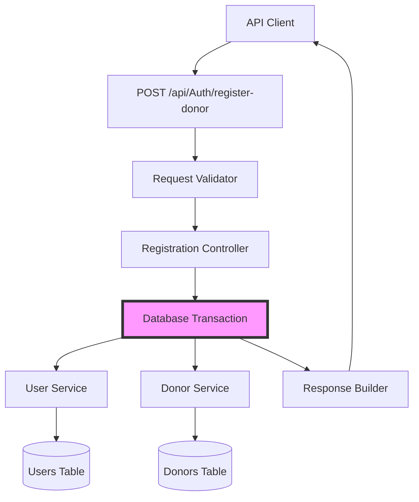
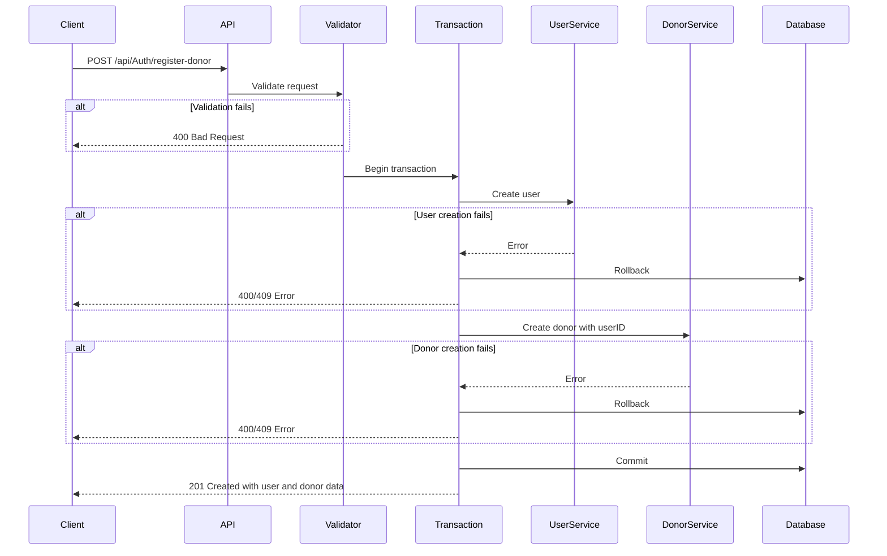
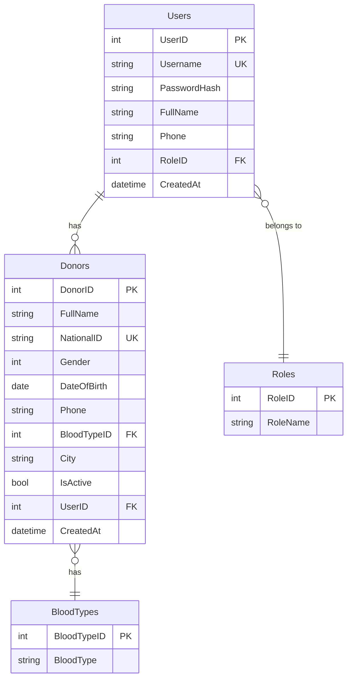

# Design Document - Donor User Registration

## Overview

This feature implements a combined registration endpoint that creates both a User account and a linked Donor profile in a single atomic operation. The design ensures data consistency through database transactions, comprehensive validation, and proper error handling.

### Goals

- Simplify the registration process by combining user and donor creation
- Ensure data consistency through atomic transactions
- Maintain backward compatibility with existing API endpoints
- Provide comprehensive validation and error handling
- Support optional fields for flexible registration workflows

### Non-Goals

- Modifying existing `/api/Auth/register` or `/api/Donors` endpoints
- Implementing email verification or two-factor authentication
- Adding new authentication mechanisms
- Supporting bulk registration operations

## Architecture

### System Components



### Transaction Flow

The registration process follows a strict transactional pattern:

1. **Begin Transaction**: Start database transaction
2. **Create User**: Insert user record with hashed password
3. **Create Donor**: Insert donor record with userID reference
4. **Commit**: If both succeed, commit transaction
5. **Rollback**: If any step fails, rollback all changes

### Data Flow



## Components and Interfaces

### API Endpoint

**Endpoint**: `POST /api/Auth/register-donor`

**Request Body**: `CombinedRegistrationRequest`

```typescript
interface CombinedRegistrationRequest {
  // User fields (from RegisterRequest)
  username: string;        // min 3 chars, required
  password: string;        // min 6 chars, required
  fullName: string;        // min 1 char, required
  phone?: string | null;   // optional, tel format
  roleId?: number;         // optional, defaults to Donor role
  
  // Donor fields (from CreateDonorDto)
  nationalID: string;      // required, unique
  gender: Gender;          // required, enum
  dateOfBirth: Date;       // required
  bloodTypeID: number;     // required
  city?: string | null;    // optional
  isActive?: boolean;      // optional, defaults to true
}
```

**Response**: `CombinedRegistrationResponse`

```typescript
interface CombinedRegistrationResponse {
  success: boolean;
  message: string;
  data: {
    user: {
      userID: number;
      username: string;
      fullName: string;
      phone: string | null;
      roleId: number;
      roleName: string;
    };
    donor: {
      donorID: number;
      fullName: string;
      nationalID: string;
      gender: Gender;
      dateOfBirth: Date;
      phone: string | null;
      bloodTypeID: number;
      bloodType: string;
      city: string | null;
      isActive: boolean;
      userID: number;
    };
  };
}
```

**Status Codes**:
- `201 Created`: Successful registration
- `400 Bad Request`: Validation errors
- `409 Conflict`: Duplicate username or nationalID
- `500 Internal Server Error`: Database or system errors

### Validation Rules

#### User Validation
- `username`: Required, minimum 3 characters, unique
- `password`: Required, minimum 6 characters
- `fullName`: Required, minimum 1 character
- `phone`: Optional, must match tel format if provided
- `roleId`: Optional, must exist in Roles table if provided

#### Donor Validation
- `nationalID`: Required, unique across donors
- `gender`: Required, must be valid Gender enum value
- `dateOfBirth`: Required, must be valid date
- `bloodTypeID`: Required, must exist in BloodTypes table
- `city`: Optional
- `isActive`: Optional, boolean

### Service Layer

#### RegistrationService

```typescript
class RegistrationService {
  async registerDonorWithUser(
    request: CombinedRegistrationRequest
  ): Promise<CombinedRegistrationResponse> {
    // 1. Validate request
    await this.validateRequest(request);
    
    // 2. Begin transaction
    const transaction = await this.db.beginTransaction();
    
    try {
      // 3. Create user
      const user = await this.userService.createUser({
        username: request.username,
        password: request.password,
        fullName: request.fullName,
        phone: request.phone,
        roleId: request.roleId || this.getDonorRoleId()
      }, transaction);
      
      // 4. Create donor with userID
      const donor = await this.donorService.createDonor({
        fullName: request.fullName,
        nationalID: request.nationalID,
        gender: request.gender,
        dateOfBirth: request.dateOfBirth,
        phone: request.phone,
        bloodTypeID: request.bloodTypeID,
        city: request.city,
        isActive: request.isActive ?? true,
        userID: user.userID
      }, transaction);
      
      // 5. Commit transaction
      await transaction.commit();
      
      // 6. Return combined response
      return this.buildSuccessResponse(user, donor);
      
    } catch (error) {
      // 7. Rollback on any error
      await transaction.rollback();
      throw this.handleError(error);
    }
  }
  
  private async validateRequest(
    request: CombinedRegistrationRequest
  ): Promise<void> {
    // Check username uniqueness
    if (await this.userService.usernameExists(request.username)) {
      throw new ConflictError('Username already exists');
    }
    
    // Check nationalID uniqueness
    if (await this.donorService.nationalIDExists(request.nationalID)) {
      throw new ConflictError('National ID already registered');
    }
    
    // Validate roleId if provided
    if (request.roleId && !await this.roleService.roleExists(request.roleId)) {
      throw new ValidationError('Invalid role ID');
    }
    
    // Validate bloodTypeID
    if (!await this.bloodTypeService.bloodTypeExists(request.bloodTypeID)) {
      throw new ValidationError('Invalid blood type ID');
    }
  }
}
```

## Data Models

### Database Schema

#### Users Table
```sql
CREATE TABLE Users (
  UserID INT PRIMARY KEY IDENTITY(1,1),
  Username NVARCHAR(50) UNIQUE NOT NULL,
  PasswordHash NVARCHAR(255) NOT NULL,
  FullName NVARCHAR(100) NOT NULL,
  Phone NVARCHAR(20) NULL,
  RoleID INT NOT NULL,
  CreatedAt DATETIME DEFAULT GETDATE(),
  CONSTRAINT FK_Users_Roles FOREIGN KEY (RoleID) REFERENCES Roles(RoleID)
);

CREATE INDEX IX_Users_Username ON Users(Username);
```

#### Donors Table
```sql
CREATE TABLE Donors (
  DonorID INT PRIMARY KEY IDENTITY(1,1),
  FullName NVARCHAR(100) NOT NULL,
  NationalID NVARCHAR(20) UNIQUE NOT NULL,
  Gender INT NOT NULL,
  DateOfBirth DATE NOT NULL,
  Phone NVARCHAR(20) NULL,
  BloodTypeID INT NOT NULL,
  City NVARCHAR(50) NULL,
  IsActive BIT DEFAULT 1,
  UserID INT NULL,
  CreatedAt DATETIME DEFAULT GETDATE(),
  CONSTRAINT FK_Donors_BloodTypes FOREIGN KEY (BloodTypeID) REFERENCES BloodTypes(BloodTypeID),
  CONSTRAINT FK_Donors_Users FOREIGN KEY (UserID) REFERENCES Users(UserID)
);

CREATE INDEX IX_Donors_NationalID ON Donors(NationalID);
CREATE INDEX IX_Donors_UserID ON Donors(UserID);
```

### Entity Relationships



## Correctness Properties

*A property is a characteristic or behavior that should hold true across all valid executions of a system—essentially, a formal statement about what the system should do. Properties serve as the bridge between human-readable specifications and machine-verifiable correctness guarantees.*

Before defining properties, I need to analyze which acceptance criteria are suitable for property-based testing.

