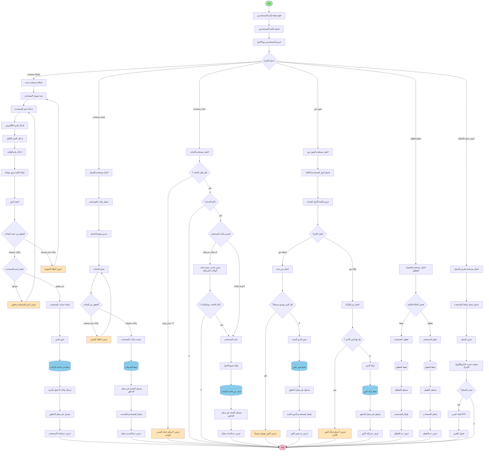
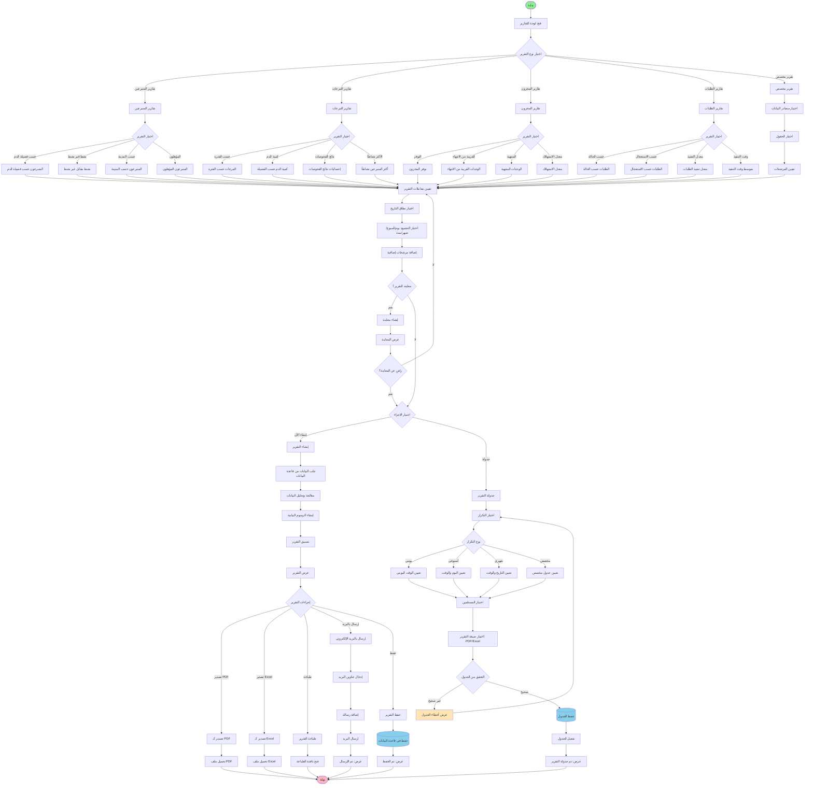
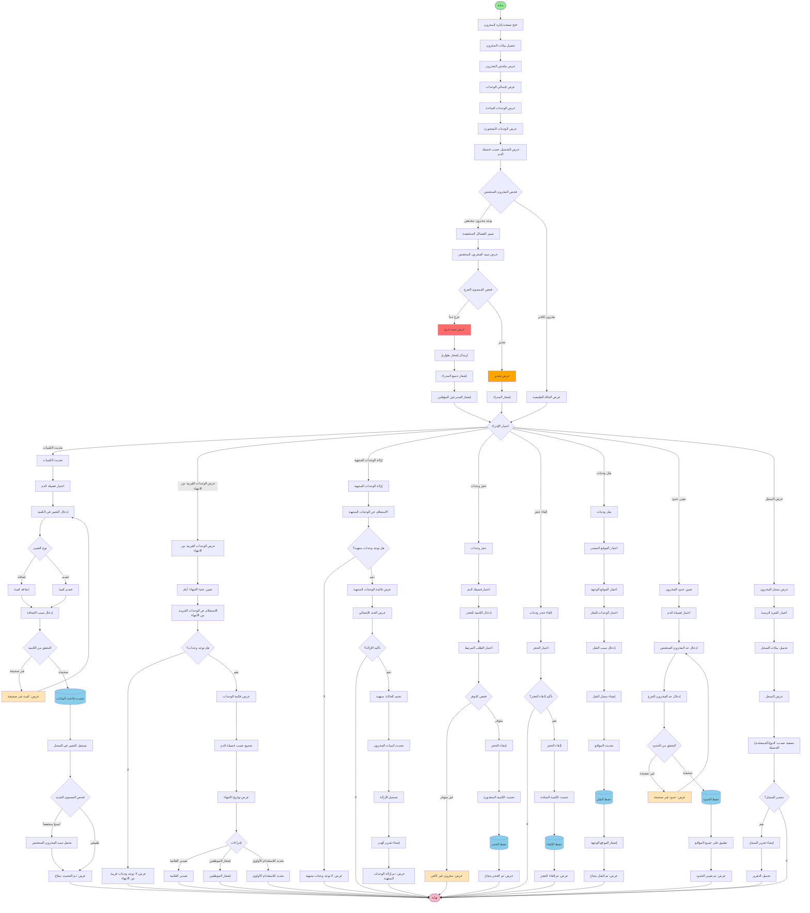

# مخططات النشاط - المدير

## 1. مخطط نشاط الموافقة على تسجيل متبرع


flowchart TD
    Start([بداية]) --> ViewPendingDonors[عرض المتبرعين المعلقين]
    ViewPendingDonors --> LoadPendingList[تحميل قائمة الموافقات المعلقة]
    LoadPendingList --> CheckPendingCount{هل توجد طلبات معلقة؟}
    
    CheckPendingCount -->|لا| ShowNoPending[عرض: لا توجد طلبات معلقة]
    ShowNoPending --> End([نهاية])
    
    CheckPendingCount -->|نعم| DisplayPendingList[عرض قائمة المتبرعين المعلقين]
    DisplayPendingList --> FilterOptions[خيارات التصفية: فصيلة الدم/المدينة/التاريخ]
    FilterOptions --> SelectDonor[اختيار متبرع للمراجعة]
    
    SelectDonor --> LoadDonorDetails[تحميل تفاصيل المتبرع]
    LoadDonorDetails --> DisplayPersonalInfo[عرض المعلومات الشخصية]
    DisplayPersonalInfo --> DisplayContactInfo[عرض معلومات الاتصال]
    DisplayContactInfo --> DisplayBloodType[عرض فصيلة الدم]
    DisplayBloodType --> LoadMedicalDocuments[تحميل الوثائق الطبية]
    
    LoadMedicalDocuments --> CheckDocuments{هل توجد وثائق؟}
    CheckDocuments -->|لا| ShowNoDocuments[عرض: لا توجد وثائق مرفقة]
    ShowNoDocuments --> DecisionWithoutDocs{قرار بدون وثائق؟}
    
    CheckDocuments -->|نعم| DisplayDocumentsList[عرض قائمة الوثائق]
    DisplayDocumentsList --> ReviewDocuments[مراجعة الوثائق]
    ReviewDocuments --> VerifyDocuments{التحقق من صحة الوثائق}
    
    VerifyDocuments -->|وثائق غير صالحة| MarkDocsInvalid[تحديد الوثائق كغير صالحة]
    MarkDocsInvalid --> DecisionWithInvalidDocs{القرار؟}
    
    VerifyDocuments -->|وثائق صالحة| MarkDocsValid[تحديد الوثائق كصالحة]
    MarkDocsValid --> MakeDecision{اتخاذ القرار}
    
    DecisionWithoutDocs -->|رفض| RejectDonor
    DecisionWithoutDocs -->|طلب وثائق| RequestDocuments[طلب رفع الوثائق]
    RequestDocuments --> NotifyDonorDocs[إشعار المتبرع بطلب الوثائق]
    NotifyDonorDocs --> End
    
    DecisionWithInvalidDocs -->|رفض| RejectDonor
    DecisionWithInvalidDocs -->|طلب إعادة رفع| RequestReupload[طلب إعادة رفع الوثائق]
    RequestReupload --> NotifyDonorReupload[إشعار المتبرع بإعادة الرفع]
    NotifyDonorReupload --> End
    
    MakeDecision -->|موافقة| ApproveDonor[الموافقة على المتبرع]
    MakeDecision -->|رفض| RejectDonor[رفض المتبرع]
    
    ApproveDonor --> UpdateStatusApproved[تحديث الحالة: موافق عليه]
    UpdateStatusApproved --> SetApprovalDate[تعيين تاريخ الموافقة]
    SetApprovalDate --> SaveApproval[(حفظ في قاعدة البيانات)]
    SaveApproval --> NotifyDonorApproved[إشعار المتبرع بالموافقة]
    NotifyDonorApproved --> SendWelcomeEmail[إرسال بريد ترحيبي]
    SendWelcomeEmail --> UpdateStatistics[تحديث إحصائيات المتبرعين]
    UpdateStatistics --> ShowApprovalSuccess[عرض: تمت الموافقة بنجاح]
    ShowApprovalSuccess --> End
    
    RejectDonor --> EnterRejectionReason[إدخال سبب الرفض]
    EnterRejectionReason --> ValidateReason{التحقق من السبب}
    ValidateReason -->|فارغ| ShowReasonRequired[عرض: السبب مطلوب]
    ShowReasonRequired --> EnterRejectionReason
    
    ValidateReason -->|صحيح| UpdateStatusRejected[تحديث الحالة: مرفوض]
    UpdateStatusRejected --> SaveRejection[(حفظ السبب في قاعدة البيانات)]
    SaveRejection --> NotifyDonorRejected[إشعار المتبرع بالرفض]
    NotifyDonorRejected --> LogRejection[تسجيل الرفض في سجل التدقيق]
    LogRejection --> ShowRejectionSuccess[عرض: تم الرفض]
    ShowRejectionSuccess --> End
    
    style Start fill:#90EE90
    style End fill:#FFB6C1
    style ShowNoPending fill:#FFE4B5
    style ShowNoDocuments fill:#FFE4B5
    style ShowReasonRequired fill:#FFE4B5
    style SaveApproval fill:#87CEEB
    style SaveRejection fill:#87CEEB
```


## 2. مخطط نشاط إدارة المستخدمين والأدوار




## 3. مخطط نشاط إنشاء وجدولة التقارير




## 4. مخطط نشاط إدارة المخزون وتنبيهات المخزون المنخفض




## 5. مخطط نشاط مراجعة سجلات التدقيق والأمان

```mermaid
flowchart TD
    Start([بداية]) --> OpenAuditPage[فتح صفحة سجلات التدقيق]
    OpenAuditPage --> SelectAuditType{اختيار نوع السجل}
    
    SelectAuditType -->|سجل التدقيق الكامل| FullAuditLog[سجل التدقيق الكامل]
    SelectAuditType -->|سجل تسجيل الدخول| LoginHistory[سجل تسجيل الدخول]
    SelectAuditType -->|تتبع الإجراءات| ActionTracking[تتبع إجراءات المستخدمين]
    SelectAuditType -->|مراجعة التغييرات| DataChanges[مراجعة التغييرات على البيانات]
    SelectAuditType -->|مراقبة الأمان| SecurityMonitoring[مراقبة أمان النظام]
    
    %% سجل التدقيق الكامل
    FullAuditLog --> SetAuditFilters[تعيين المرشحات]
    SetAuditFilters --> SelectDateRange[اختيار نطاق التاريخ]
    SelectDateRange --> SelectUser[اختيار مستخدم محدد اختياري]
    SelectUser --> SelectActionType[اختيار نوع الإجراء]
    SelectActionType --> SelectModule[اختيار الوحدة: متبرعين/تبرعات/مخزون]
    
    SelectModule --> LoadAuditData[تحميل بيانات التدقيق]
    LoadAuditData --> CheckAuditData{هل توجد بيانات؟}
    
    CheckAuditData -->|لا| ShowNoAuditData[عرض: لا توجد سجلات]
    ShowNoAuditData --> End([نهاية])
    
    CheckAuditData -->|نعم| DisplayAuditLog[عرض سجل التدقيق]
    DisplayAuditLog --> ShowAuditDetails[عرض التفاصيل]
    ShowAuditDetails --> ForEachEntry[لكل سجل]
    
    ForEachEntry --> ShowTimestamp[عرض الطابع الزمني]
    ShowTimestamp --> ShowUser[عرض المستخدم]
    ShowUser --> ShowAction[عرض الإجراء]
    ShowAction --> ShowModule[عرض الوحدة]
    ShowModule --> ShowIPAddress[عرض عنوان IP]
    ShowIPAddress --> ShowBeforeAfter[عرض البيانات قبل/بعد]
    
    ShowBeforeAfter --> AuditActions{إجراءات التدقيق}
    AuditActions -->|عرض التفاصيل| ViewAuditDetails[عرض تفاصيل السجل]
    AuditActions -->|تصدير| ExportAuditLog[تصدير سجل التدقيق]
    AuditActions -->|تحليل| AnalyzeAudit[تحليل الأنماط]
    AuditActions -->|إنشاء تقرير| GenerateAuditReport[إنشاء تقرير التدقيق]
    
    ViewAuditDetails --> ShowFullDetails[عرض التفاصيل الكاملة]
    ShowFullDetails --> ShowRequestData[عرض بيانات الطلب]
    ShowRequestData --> ShowResponseData[عرض بيانات الاستجابة]
    ShowResponseData --> End
    
    ExportAuditLog --> SelectExportFormat{اختيار صيغة التصدير}
    SelectExportFormat -->|PDF| ExportAuditPDF[تصدير كـ PDF]
    SelectExportFormat -->|Excel| ExportAuditExcel[تصدير كـ Excel]
    SelectExportFormat -->|CSV| ExportAuditCSV[تصدير كـ CSV]
    SelectExportFormat -->|JSON| ExportAuditJSON[تصدير كـ JSON]
    
    ExportAuditPDF --> DownloadAuditFile[تحميل الملف]
    ExportAuditExcel --> DownloadAuditFile
    ExportAuditCSV --> DownloadAuditFile
    ExportAuditJSON --> DownloadAuditFile
    DownloadAuditFile --> End
    
    AnalyzeAudit --> DetectPatterns[كشف الأنماط]
    DetectPatterns --> IdentifyAnomalies[تحديد الشذوذات]
    IdentifyAnomalies --> CheckSuspicious{هل توجد أنشطة مشبوهة؟}
    
    CheckSuspicious -->|نعم| HighlightSuspicious[تمييز الأنشطة المشبوهة]
    HighlightSuspicious --> GenerateSecurityAlert[إنشاء تنبيه أمني]
    GenerateSecurityAlert --> NotifySecurityTeam[إشعار فريق الأمان]
    NotifySecurityTeam --> End
    
    CheckSuspicious -->|لا| ShowAnalysisResults[عرض نتائج التحليل]
    ShowAnalysisResults --> End
    
    GenerateAuditReport --> SelectReportType[اختيار نوع التقرير]
    SelectReportType --> CompileAuditData[تجميع بيانات التدقيق]
    CompileAuditData --> CreateAuditSummary[إنشاء ملخص]
    CreateAuditSummary --> AddCharts[إضافة رسوم بيانية]
    AddCharts --> FormatAuditReport[تنسيق التقرير]
    FormatAuditReport --> SaveAuditReport[(حفظ التقرير)]
    SaveAuditReport --> End
    
    %% سجل تسجيل الدخول
    LoginHistory --> SetLoginFilters[تعيين مرشحات تسجيل الدخول]
    SetLoginFilters --> SelectLoginDateRange[اختيار نطاق التاريخ]
    SelectLoginDateRange --> SelectLoginUser[اختيار مستخدم]
    SelectLoginUser --> SelectLoginStatus{اختيار الحالة}
    
    SelectLoginStatus -->|ناجح| SuccessfulLogins[تسجيلات الدخول الناجحة]
    SelectLoginStatus -->|فاشل| FailedLogins[محاولات الدخول الفاشلة]
    SelectLoginStatus -->|الكل| AllLogins[جميع محاولات الدخول]
    
    SuccessfulLogins --> LoadLoginData
    FailedLogins --> LoadLoginData
    AllLogins --> LoadLoginData
    
    LoadLoginData[تحميل بيانات تسجيل الدخول]
    LoadLoginData --> DisplayLoginHistory[عرض سجل تسجيل الدخول]
    DisplayLoginHistory --> ShowLoginDetails[عرض التفاصيل]
    
    ShowLoginDetails --> ForEachLogin[لكل محاولة]
    ForEachLogin --> ShowLoginTime[عرض الوقت]
    ShowLoginTime --> ShowLoginUser[عرض المستخدم]
    ShowLoginUser --> ShowLoginIP[عرض عنوان IP]
    ShowLoginIP --> ShowLoginDevice[عرض الجهاز/المتصفح]
    ShowLoginDevice --> ShowLoginStatus[عرض الحالة]
    ShowLoginStatus --> ShowLoginLocation[عرض الموقع الجغرافي]
    
    ShowLoginLocation --> CheckFailedAttempts{فحص المحاولات الفاشلة}
    CheckFailedAttempts -->|محاولات متعددة| HighlightBruteForce[تمييز محاولات القوة الغاشمة]
    HighlightBruteForce --> BlockSuspiciousIP[حظر IP المشبوه]
    BlockSuspiciousIP --> NotifyAdmin[إشعار المدير]
    NotifyAdmin --> End
    
    CheckFailedAttempts -->|طبيعي| LoginActions{إجراءات}
    LoginActions -->|تصدير| ExportLoginHistory[تصدير سجل الدخول]
    LoginActions -->|تحليل| AnalyzeLoginPatterns[تحليل أنماط الدخول]
    
    ExportLoginHistory --> End
    AnalyzeLoginPatterns --> End
    
    %% تتبع الإجراءات
    ActionTracking --> SelectActionUser[اختيار المستخدم]
    SelectActionUser --> SelectActionPeriod[اختيار الفترة]
    SelectActionPeriod --> LoadUserActions[تحميل إجراءات المستخدم]
    LoadUserActions --> DisplayActionTimeline[عرض الجدول الزمني للإجراءات]
    
    DisplayActionTimeline --> GroupByModule[تجميع حسب الوحدة]
    GroupByModule --> ShowActionStats[عرض إحصائيات الإجراءات]
    ShowActionStats --> IdentifyUnusualActivity{تحديد نشاط غير عادي؟}
    
    IdentifyUnusualActivity -->|نعم| FlagUnusualActivity[وضع علامة على النشاط]
    FlagUnusualActivity --> InvestigateActivity[التحقيق في النشاط]
    InvestigateActivity --> End
    
    IdentifyUnusualActivity -->|لا| End
    
    %% مراجعة التغييرات
    DataChanges --> SelectDataModule[اختيار الوحدة]
    SelectDataModule --> SelectChangePeriod[اختيار الفترة]
    SelectChangePeriod --> LoadDataChanges[تحميل التغييرات]
    LoadDataChanges --> DisplayChanges[عرض التغييرات]
    
    DisplayChanges --> ForEachChange[لكل تغيير]
    ForEachChange --> ShowChangeType[عرض نوع التغيير: إضافة/تعديل/حذف]
    ShowChangeType --> ShowChangedBy[عرض من قام بالتغيير]
    ShowChangedBy --> ShowChangeTime[عرض وقت التغيير]
    ShowChangeTime --> ShowOldValue[عرض القيمة القديمة]
    ShowOldValue --> ShowNewValue[عرض القيمة الجديدة]
    
    ShowNewValue --> ChangeActions{إجراءات}
    ChangeActions -->|التراجع| RevertChange[التراجع عن التغيير]
    ChangeActions -->|مقارنة| CompareVersions[مقارنة الإصدارات]
    ChangeActions -->|تدقيق| AuditChange[تدقيق التغيير]
    
    RevertChange --> ConfirmRevert{تأكيد التراجع؟}
    ConfirmRevert -->|نعم| ExecuteRevert[تنفيذ التراجع]
    ExecuteRevert --> LogRevert[تسجيل التراجع]
    LogRevert --> NotifyRevert[إشعار المستخدم]
    NotifyRevert --> End
    ConfirmRevert -->|لا| End
    
    CompareVersions --> ShowDifferences[عرض الاختلافات]
    ShowDifferences --> End
    
    AuditChange --> ReviewChangeDetails[مراجعة تفاصيل التغيير]
    ReviewChangeDetails --> ApproveChange{الموافقة على التغيير؟}
    ApproveChange -->|نعم| MarkAsApproved[تحديد كموافق عليه]
    ApproveChange -->|لا| MarkAsRejected[تحديد كمرفوض]
    MarkAsApproved --> End
    MarkAsRejected --> End
    
    %% مراقبة الأمان
    SecurityMonitoring --> LoadSecurityMetrics[تحميل مقاييس الأمان]
    LoadSecurityMetrics --> DisplaySecurityDashboard[عرض لوحة الأمان]
    
    DisplaySecurityDashboard --> ShowActiveUsers[عرض المستخدمين النشطين]
    ShowActiveUsers --> ShowFailedLoginAttempts[عرض محاولات الدخول الفاشلة]
    ShowFailedLoginAttempts --> ShowSuspiciousActivities[عرض الأنشطة المشبوهة]
    ShowSuspiciousActivities --> ShowSecurityAlerts[عرض التنبيهات الأمنية]
    
    ShowSecurityAlerts --> CheckSecurityThreats{فحص التهديدات}
    CheckSecurityThreats -->|توجد تهديدات| HandleThreat[معالجة التهديد]
    CheckSecurityThreats -->|لا توجد تهديدات| MonitorContinuously[المراقبة المستمرة]
    
    HandleThreat --> IdentifyThreatType[تحديد نوع التهديد]
    IdentifyThreatType --> TakeAction[اتخاذ الإجراء المناسب]
    TakeAction --> BlockAccess[حظر الوصول]
    BlockAccess --> NotifySecurityAdmin[إشعار مدير الأمان]
    NotifySecurityAdmin --> LogSecurityIncident[تسجيل الحادثة الأمنية]
    LogSecurityIncident --> End
    
    MonitorContinuously --> End
    
    style Start fill:#90EE90
    style End fill:#FFB6C1
    style ShowNoAuditData fill:#FFE4B5
    style GenerateSecurityAlert fill:#FF6B6B
    style HighlightBruteForce fill:#FF6B6B
    style BlockSuspiciousIP fill:#FF6B6B
    style HandleThreat fill:#FF6B6B
    style SaveAuditReport fill:#87CEEB
    style LogRevert fill:#87CEEB
    style LogSecurityIncident fill:#87CEEB


## 📝 ملاحظات خاصة بالمدير

### 🔐 صلاحيات المدير الحصرية
- إدارة المستخدمين والأدوار
- الموافقة على تسجيل المتبرعين
- الوصول إلى سجلات التدقيق الكاملة
- تكوين إعدادات النظام
- إدارة النسخ الاحتياطي
- حذف السجلات
- تصدير البيانات الكاملة

### 📊 أنواع التقارير المتاحة
1. **تقارير المتبرعين:** حسب فصيلة الدم، المدينة، الحالة
2. **تقارير التبرعات:** حسب الفترة، الكمية، نتائج الفحوصات
3. **تقارير المخزون:** التوفر، الوحدات المنتهية، معدل الاستهلاك
4. **تقارير الطلبات:** حسب الحالة، الاستعجال، معدل التنفيذ

### 🔔 تنبيهات المخزون
- **حرج:** أقل من 10 وحدات
- **تحذير:** أقل من 20 وحدة
- **طبيعي:** 20 وحدة فأكثر

### 🔒 سجلات التدقيق
تتضمن:
- من قام بالعملية
- ماذا فعل
- متى (التاريخ والوقت)
- من أين (عنوان IP)
- البيانات قبل وبعد التغيير

### 🎨 دليل الألوان
- 🟢 **أخضر فاتح:** نقطة البداية
- 🔴 **وردي فاتح:** نقطة النهاية
- 🟡 **برتقالي فاتح:** رسائل الخطأ والتحذيرات
- 🔵 **أزرق فاتح:** عمليات قاعدة البيانات
- 🔴 **أحمر:** تنبيهات الطوارئ والأمان
- 🟠 **برتقالي:** تحذيرات المخزون

