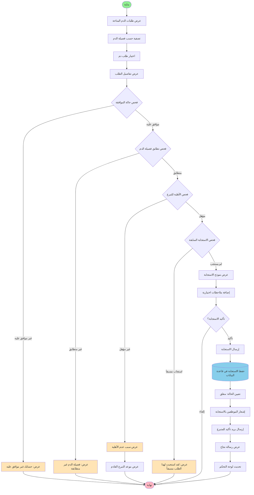
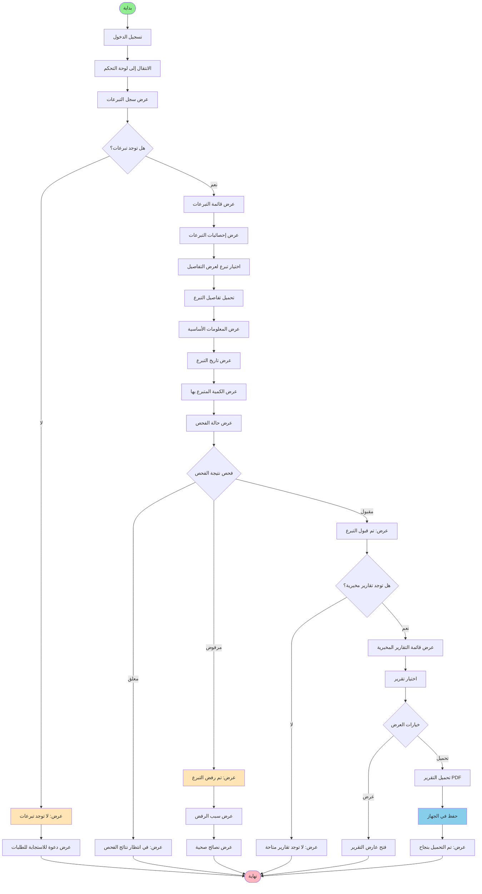
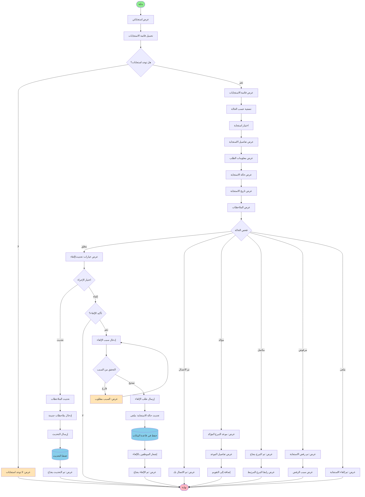

# مخططات النشاط - المتبرع

## 1. مخطط نشاط تسجيل متبرع جديد


flowchart TD
    Start([بداية]) --> OpenRegisterPage[فتح صفحة التسجيل]
    OpenRegisterPage --> FillPersonalInfo[ملء المعلومات الشخصية]
    FillPersonalInfo --> EnterUsername[إدخال اسم المستخدم]
    EnterUsername --> EnterEmail[إدخال البريد الإلكتروني]
    EnterEmail --> EnterPassword[إدخال كلمة المرور]
    EnterPassword --> ConfirmPassword[تأكيد كلمة المرور]
    
    ConfirmPassword --> FillDonorInfo[ملء معلومات المتبرع]
    FillDonorInfo --> EnterFullName[إدخال الاسم الكامل]
    EnterFullName --> EnterNationalID[إدخال الرقم الوطني]
    EnterNationalID --> SelectGender[اختيار الجنس]
    SelectGender --> EnterBirthDate[إدخال تاريخ الميلاد]
    EnterBirthDate --> EnterPhone[إدخال رقم الهاتف]
    EnterPhone --> SelectBloodType[اختيار فصيلة الدم]
    SelectBloodType --> EnterCity[إدخال المدينة]
    
    EnterCity --> UploadDocuments[رفع الوثائق الطبية]
    UploadDocuments --> SelectFiles[اختيار الملفات]
    SelectFiles --> ValidateFiles{التحقق من الملفات}
    
    ValidateFiles -->|ملفات غير صالحة| ShowFileError[عرض: نوع أو حجم ملف غير صالح]
    ShowFileError --> SelectFiles
    
    ValidateFiles -->|ملفات صالحة| ValidateForm{التحقق من صحة النموذج}
    ValidateForm -->|بيانات غير صحيحة| ShowValidationErrors[عرض أخطاء التحقق]
    ShowValidationErrors --> FillPersonalInfo
    
    ValidateForm -->|بيانات صحيحة| CheckNationalID{فحص الرقم الوطني}
    CheckNationalID -->|موجود مسبقاً| ShowDuplicateError[عرض: الرقم الوطني مسجل مسبقاً]
    ShowDuplicateError --> EnterNationalID
    
    CheckNationalID -->|غير موجود| CheckUsername{فحص اسم المستخدم}
    CheckUsername -->|موجود مسبقاً| ShowUsernameError[عرض: اسم المستخدم محجوز]
    ShowUsernameError --> EnterUsername
    
    CheckUsername -->|متاح| SubmitRegistration[إرسال طلب التسجيل]
    SubmitRegistration --> CreateUserAccount[إنشاء حساب مستخدم]
    CreateUserAccount --> CreateDonorProfile[إنشاء ملف متبرع]
    CreateDonorProfile --> SaveDocuments[(حفظ الوثائق الطبية)]
    SaveDocuments --> SetStatusPending[تعيين الحالة: معلق]
    SetStatusPending --> NotifyAdmins[إشعار المدراء بطلب جديد]
    NotifyAdmins --> SendWelcomeEmail[إرسال بريد ترحيبي]
    SendWelcomeEmail --> ShowSuccessMessage[عرض رسالة نجاح التسجيل]
    ShowSuccessMessage --> RedirectToLogin[التوجيه إلى صفحة تسجيل الدخول]
    RedirectToLogin --> End([نهاية])
    
    style Start fill:#90EE90
    style End fill:#FFB6C1
    style ShowFileError fill:#FFE4B5
    style ShowValidationErrors fill:#FFE4B5
    style ShowDuplicateError fill:#FFE4B5
    style ShowUsernameError fill:#FFE4B5
    style SaveDocuments fill:#87CEEB
```


## 2. مخطط نشاط الاستجابة لطلب دم



## 3. مخطط نشاط عرض وتتبع التبرعات




## 4. مخطط نشاط إدارة الاستجابات




## 5. مخطط نشاط إدارة الإشعارات

```mermaid
flowchart TD
    Start([بداية]) --> CheckNotificationBell[فحص جرس الإشعارات]
    CheckNotificationBell --> LoadUnreadCount[تحميل عدد الإشعارات غير المقروءة]
    LoadUnreadCount --> DisplayBadge[عرض شارة العدد]
    
    DisplayBadge --> UserClicksBell{المستخدم ينقر على الجرس؟}
    UserClicksBell -->|لا| WaitForClick[انتظار النقر]
    WaitForClick --> UserClicksBell
    
    UserClicksBell -->|نعم| OpenNotificationPanel[فتح لوحة الإشعارات]
    OpenNotificationPanel --> LoadNotifications[تحميل الإشعارات آخر 30 يوم]
    LoadNotifications --> CheckNotifications{هل توجد إشعارات؟}
    
    CheckNotifications -->|لا| ShowNoNotifications[عرض: لا توجد إشعارات]
    ShowNoNotifications --> End([نهاية])
    
    CheckNotifications -->|نعم| DisplayNotificationsList[عرض قائمة الإشعارات]
    DisplayNotificationsList --> GroupByType[تجميع حسب النوع]
    GroupByType --> HighlightUnread[تمييز غير المقروءة]
    
    HighlightUnread --> UserSelectsAction{اختيار الإجراء}
    UserSelectsAction -->|قراءة إشعار| SelectNotification[اختيار إشعار]
    UserSelectsAction -->|تحديد الكل كمقروء| MarkAllAsRead[تحديد الكل كمقروء]
    UserSelectsAction -->|حذف إشعار| SelectToDelete[اختيار إشعار للحذف]
    UserSelectsAction -->|إغلاق| End
    
    SelectNotification --> ViewNotificationDetails[عرض تفاصيل الإشعار]
    ViewNotificationDetails --> CheckIfRead{هل مقروء؟}
    
    CheckIfRead -->|نعم| ShowDetails[عرض التفاصيل]
    CheckIfRead -->|لا| MarkAsRead[تحديد كمقروء]
    MarkAsRead --> UpdateReadStatus[(تحديث الحالة في قاعدة البيانات)]
    UpdateReadStatus --> DecrementBadge[تقليل عدد الشارة]
    DecrementBadge --> ShowDetails
    
    ShowDetails --> CheckNotificationType{نوع الإشعار}
    CheckNotificationType -->|طلب دم جديد| NavigateToRequest[الانتقال إلى الطلب]
    CheckNotificationType -->|تحديث استجابة| NavigateToResponse[الانتقال إلى الاستجابة]
    CheckNotificationType -->|موافقة حساب| ShowApprovalMessage[عرض رسالة الموافقة]
    CheckNotificationType -->|نتيجة فحص| NavigateToDonation[الانتقال إلى التبرع]
    CheckNotificationType -->|تذكير موعد| ShowAppointmentReminder[عرض تذكير الموعد]
    
    NavigateToRequest --> End
    NavigateToResponse --> End
    ShowApprovalMessage --> End
    NavigateToDonation --> End
    ShowAppointmentReminder --> End
    
    MarkAllAsRead --> ConfirmMarkAll{تأكيد تحديد الكل؟}
    ConfirmMarkAll -->|لا| End
    ConfirmMarkAll -->|نعم| UpdateAllNotifications[(تحديث جميع الإشعارات)]
    UpdateAllNotifications --> ResetBadge[إعادة تعيين الشارة إلى 0]
    ResetBadge --> ShowMarkAllSuccess[عرض: تم تحديد الكل كمقروء]
    ShowMarkAllSuccess --> End
    
    SelectToDelete --> ConfirmDelete{تأكيد الحذف؟}
    ConfirmDelete -->|لا| End
    ConfirmDelete -->|نعم| DeleteNotification[(حذف الإشعار)]
    DeleteNotification --> RefreshList[تحديث القائمة]
    RefreshList --> ShowDeleteSuccess[عرض: تم الحذف بنجاح]
    ShowDeleteSuccess --> End
    
    style Start fill:#90EE90
    style End fill:#FFB6C1
    style ShowNoNotifications fill:#FFE4B5
    style UpdateReadStatus fill:#87CEEB
    style UpdateAllNotifications fill:#87CEEB
    style DeleteNotification fill:#87CEEB


## 📝 ملاحظات خاصة بالمتبرع

### 🔐 شروط الأهلية للتبرع
- **العمر:** 18-65 سنة
- **الوزن:** أكثر من 50 كجم
- **الفترة بين التبرعات:** 56 يوماً (8 أسابيع) على الأقل
- **الحالة الصحية:** خالي من الأمراض المعدية
- **ضغط الدم:** ضمن المعدل الطبيعي
- **الهيموجلوبين:** مستوى كافي

### 🔄 دورة حياة الاستجابة
```
معلق (Pending)
    ↓
تم الاتصال (Contacted)
    ↓
مؤكد (Confirmed)
    ↓
مكتمل (Completed)
```

**أو:**
```
معلق → مرفوض (Rejected)
معلق → ملغى (Cancelled)
```

### 🔔 أنواع الإشعارات
1. **طلب دم جديد:** عند وجود طلب يطابق فصيلة دم المتبرع
2. **تحديث استجابة:** عند تغيير حالة الاستجابة
3. **موافقة الحساب:** عند الموافقة على التسجيل أو رفضه
4. **نتيجة الفحص:** عند توفر نتائج الفحوصات المخبرية
5. **تذكير موعد:** قبل موعد التبرع المؤكد بـ 24 ساعة
6. **طلب طارئ:** عند وجود طلب طارئ يحتاج لفصيلة دم المتبرع

### 📊 لوحة تحكم المتبرع
تعرض:
- إجمالي عدد التبرعات
- تاريخ آخر تبرع
- موعد التبرع القادم المتاح
- عدد الاستجابات المعلقة
- الإشعارات غير المقروءة
- الطلبات العاجلة والطارئة

### 🎨 دليل الألوان
- 🟢 **أخضر فاتح:** نقطة البداية
- 🔴 **وردي فاتح:** نقطة النهاية
- 🟡 **برتقالي فاتح:** رسائل الخطأ والتحذيرات
- 🔵 **أزرق فاتح:** عمليات قاعدة البيانات

