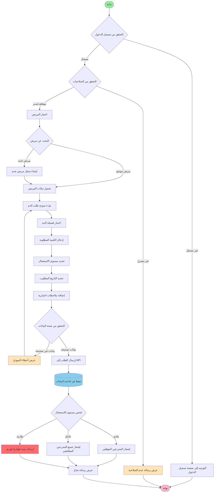
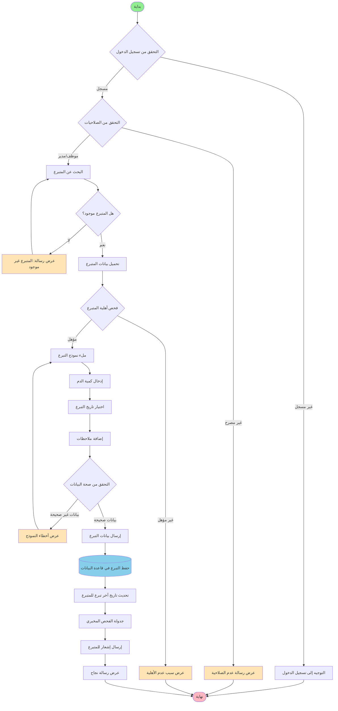
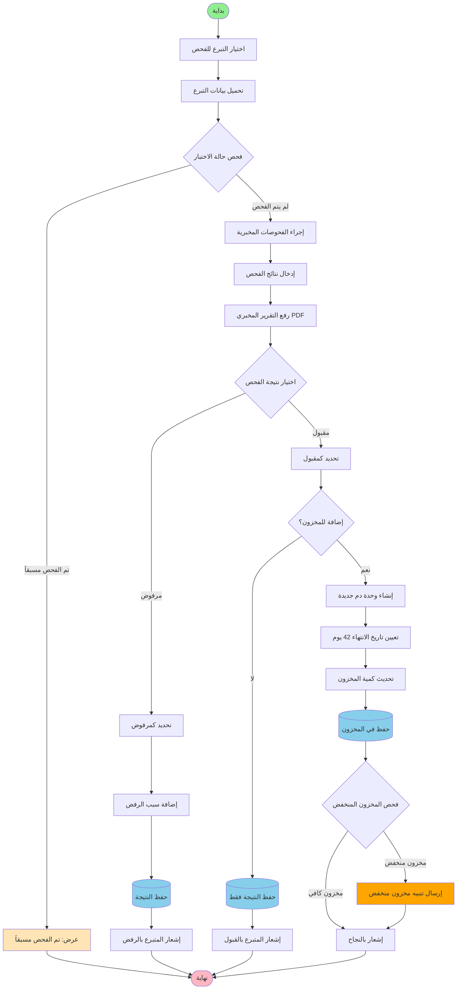
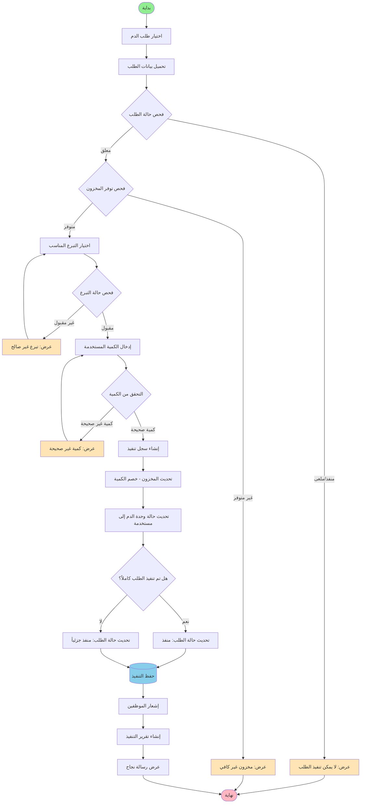

# مخططات النشاط - نظرة عامة على النظام

## 1. مخطط نشاط تسجيل الدخول والمصادقة


flowchart TD
    Start([بداية]) --> InputCredentials[إدخال اسم المستخدم وكلمة المرور]
    InputCredentials --> ValidateInput{التحقق من صحة الإدخال}
    
    ValidateInput -->|بيانات غير صحيحة| ShowValidationError[عرض رسالة خطأ التحقق]
    ShowValidationError --> InputCredentials
    
    ValidateInput -->|بيانات صحيحة| SendLoginRequest[إرسال طلب تسجيل الدخول إلى API]
    SendLoginRequest --> CheckCredentials{التحقق من بيانات الاعتماد}
    
    CheckCredentials -->|بيانات خاطئة| ShowLoginError[عرض رسالة خطأ تسجيل الدخول]
    ShowLoginError --> InputCredentials
    
    CheckCredentials -->|بيانات صحيحة| GenerateToken[إنشاء رمز JWT]
    GenerateToken --> GetUserRoles[جلب أدوار المستخدم]
    GetUserRoles --> SaveToken[حفظ الرمز في LocalStorage]
    SaveToken --> CheckRole{تحديد دور المستخدم}
    
    CheckRole -->|متبرع| RedirectDonor[التوجيه إلى لوحة تحكم المتبرع]
    CheckRole -->|موظف| RedirectStaff[التوجيه إلى لوحة تحكم الموظف]
    CheckRole -->|مدير| RedirectAdmin[التوجيه إلى لوحة تحكم المدير]
    
    RedirectDonor --> End([نهاية])
    RedirectStaff --> End
    RedirectAdmin --> End
    
    style Start fill:#90EE90
    style End fill:#FFB6C1
    style ShowValidationError fill:#FFE4B5
    style ShowLoginError fill:#FFE4B5
```

## 2. مخطط نشاط إنشاء طلب دم جديد




## 3. مخطط نشاط تسجيل تبرع جديد



## 4. مخطط نشاط إجراء فحص مخبري وتحديث المخزون




## 5. مخطط نشاط تنفيذ طلب دم



## 6. مخطط نشاط إزالة الوحدات المنتهية تلقائياً (عملية النظام)

```mermaid
flowchart TD
    Start([بداية - مهمة مجدولة يومياً]) --> GetCurrentDate[الحصول على التاريخ الحالي]
    GetCurrentDate --> QueryExpiredUnits[الاستعلام عن الوحدات المنتهية]
    QueryExpiredUnits --> CheckExpiredUnits{هل توجد وحدات منتهية؟}
    
    CheckExpiredUnits -->|لا| LogNoExpired[تسجيل: لا توجد وحدات منتهية]
    LogNoExpired --> End([نهاية])
    
    CheckExpiredUnits -->|نعم| LoopUnits[حلقة: لكل وحدة منتهية]
    LoopUnits --> CheckUnitStatus{فحص حالة الوحدة}
    
    CheckUnitStatus -->|مستخدمة/محجوزة| SkipUnit[تخطي الوحدة]
    SkipUnit --> MoreUnits{المزيد من الوحدات؟}
    
    CheckUnitStatus -->|متاحة| MarkAsExpired[تحديد الحالة: منتهية]
    MarkAsExpired --> UpdateInventoryQuantity[تحديث كمية المخزون - خصم]
    UpdateInventoryQuantity --> LogExpiredUnit[تسجيل الوحدة المنتهية]
    LogExpiredUnit --> MoreUnits
    
    MoreUnits -->|نعم| LoopUnits
    MoreUnits -->|لا| GenerateReport[إنشاء تقرير الوحدات المنتهية]
    GenerateReport --> CheckCriticalStock{فحص المخزون الحرج}
    
    CheckCriticalStock -->|مخزون حرج| SendCriticalAlert[إرسال تنبيه حرج للمدير]
    CheckCriticalStock -->|مخزون عادي| SendSummaryEmail[إرسال ملخص بالبريد]
    
    SendCriticalAlert --> UpdateSystemLogs[تحديث سجلات النظام]
    SendSummaryEmail --> UpdateSystemLogs
    UpdateSystemLogs --> End
    
    style Start fill:#90EE90
    style End fill:#FFB6C1
    style SendCriticalAlert fill:#FF6B6B
    style LogExpiredUnit fill:#87CEEB
    style UpdateSystemLogs fill:#87CEEB


## 📝 ملاحظات عامة

### 🎨 دليل الألوان
- 🟢 **أخضر فاتح:** نقطة البداية
- 🔴 **وردي فاتح:** نقطة النهاية
- 🟡 **برتقالي فاتح:** رسائل الخطأ والتحذيرات
- 🔵 **أزرق فاتح:** عمليات قاعدة البيانات
- 🔴 **أحمر:** تنبيهات الطوارئ
- 🟠 **برتقالي:** تنبيهات المخزون

### 🔄 العمليات التلقائية
- إزالة الوحدات المنتهية: تعمل يومياً في منتصف الليل
- فحص المخزون المنخفض: يعمل كل 6 ساعات
- إرسال الإشعارات: فوري عند حدوث الأحداث

### 🔐 التحقق من الصلاحيات
جميع العمليات تتطلب:
1. التحقق من تسجيل الدخول
2. التحقق من صلاحيات الدور
3. التحقق من صلاحية الرمز (JWT)

