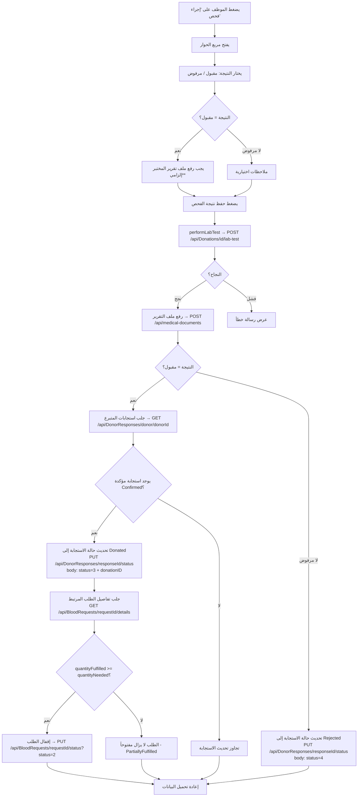

# تحديث مربع حوار "إجراء الفحص" في إدارة التبرعات

## الهدف

تحسين مربع حوار إجراء الفحص المخبري في شاشة إدارة التبرعات بحيث:
1. **يُلزم برفع تقرير المختبر** قبل قبول العينة (كما يحدث في نموذج تسجيل التبرع)
2. **يُحدّث جدول `DonorRequestResponses`** عند قبول التبرع — بتعيين حالة الاستجابة إلى `Donated` وربطها بـ `donationId`
3. **يُقفل الطلب المرتبط** في حالة:
   - الموافقة على التبرع إذا اكتملت الوحدات المطلوبة → `RequestStatus.Fulfilled = 2`
   - الوصول إلى عدد الوحدات المطلوب عبر تبرعات متعددة → `RequestStatus.Fulfilled = 2`

---

## الملفات المتأثرة

### مكون الواجهة الأمامية

---

#### [MODIFY] [DonationsManagement.tsx](file:///c:/Users/Masoud/WebstormProjects/BloodConnectHub/src/pages/DonationsManagement.tsx)

هذا هو الملف الرئيسي الذي يحتاج للتعديل. التغييرات المطلوبة:

**أ — إضافة state جديدة لمربع الحوار:**
```typescript
// state لملف تقرير المختبر في مربع حوار إجراء الفحص
const [labTestFile, setLabTestFile] = useState<File | null>(null);
const labTestFileRef = useRef<HTMLInputElement>(null);

// state لـ requestId المرتبط بالتبرع المُختار
// يحتاج أن نعرف: هل هذا التبرع مرتبط باستجابة لطلب دم؟
```

**ب — إضافة hooks جديدة:**
```typescript
import { useUpdateResponseStatus } from '@/hooks/useDonorResponses';
import { useUpdateBloodRequestStatus } from '@/hooks/useBloodRequests';
```

**ج — منطق المعالجة `handlePerformLabTest` المُحدَّث:**

الخطوات التسلسلية:
1. التحقق من وجود ملف تقرير المختبر (إلزامي عند الاختيار `Accepted`)
2. استدعاء `performLabTest.mutateAsync()` — يُسجّل نتيجة الفحص (`/api/Donations/{id}/lab-test`)
3. رفع ملف التقرير عبر `uploadDocument.mutateAsync()` — (`/api/medical-documents`)
4. إذا كانت النتيجة `Accepted`:
   - تحديث `DonorRequestResponses` عبر `PUT /api/DonorResponses/{responseId}/status` بـ `status: Donated (3)` و `donationID`
   - جلب تفاصيل الطلب المرتبط لمعرفة هل اكتملت الوحدات أم لا
   - إذا اكتملت الوحدات → استدعاء `PUT /api/BloodRequests/{requestId}/status?status=2`

**د — تحديث مربع الحوار (JSX):**
- إضافة قسم رفع تقرير المختبر بشكل إلزامي عند اختيار `Accepted`
- إضافة رسالة تحذير واضحة: "يجب رفع تقرير المختبر قبل قبول العينة"
- تعطيل زر الحفظ إذا كان `Accepted` ولم يُرفق ملف

**هـ — تحديد البيانات المطلوبة:**

> [!IMPORTANT]
> **مشكلة رئيسية**: كيف نعرف `responseId` و`requestId` المرتبطان بالتبرع المختار؟
>
> التبرع (`DonationDto`) لا يحتوي مباشرة على `requestId` أو `responseId`. نحتاج إلى أحد الحلول:
> - **الحل المقترح**: عند فتح مربع الحوار، نحتفظ بـ `donorId` من بيانات التبرع، ثم نجلب استجابات المتبرع عبر `GET /api/DonorResponses/donor/{donorId}` لإيجاد الاستجابة المؤكدة (`Confirmed`) المرتبطة بهذا التبرع
> - **أو**: نخزن المعلومات الإضافية عند اختيار التبرع

---

#### [MODIFY] [DonationsManagement.tsx](file:///c:/Users/Masoud/WebstormProjects/BloodConnectHub/src/pages/DonationsManagement.tsx) — تفاصيل إضافية

**State جديدة لتتبع المعلومات المرتبطة بالتبرع المختار:**
```typescript
// تخزين معلومات التبرع المختار كاملاً
interface SelectedDonationInfo {
  id: number;
  donorId: number;
  bloodTypeId: number;
  quantity: number;
}
const [selectedDonationInfo, setSelectedDonationInfo] = useState<SelectedDonationInfo | null>(null);
```

---

### طبقة الـ hooks

---

#### [MODIFY] [useDonations.ts](file:///c:/Users/Masoud/WebstormProjects/BloodConnectHub/src/hooks/useDonations.ts)

لا تعديلات مطلوبة — الـ hooks الموجودة كافية:
- `usePerformLabTest` → `POST /api/Donations/{id}/lab-test` مع `LabTestDonationDto`
- `useUpdateDonationTestResult` → `PUT /api/Donations/{id}/test-result`

---

#### [MODIFY] [useDonorResponses.ts](file:///c:/Users/Masoud/WebstormProjects/BloodConnectHub/src/hooks/useDonorResponses.ts)

سنستخدم الـ hook الموجود `useUpdateResponseStatus`. لكن قد نحتاج hook إضافي لجلب استجابات متبرع بشكل مُحدَّد عند تحميل الحوار.

**ملاحظة**: الـ hook `useUpdateResponseStatus` يستدعي `PUT /api/DonorResponses/{id}/status` مع `UpdateResponseStatusDto`:
```json
{
  "status": 3,           // Donated
  "notes": "...",
  "donationID": 123      // معرف التبرع
}
```

---

#### [MODIFY] [useBloodRequests.ts](file:///c:/Users/Masoud/WebstormProjects/BloodConnectHub/src/hooks/useBloodRequests.ts)

سنستخدم `useUpdateBloodRequestStatus` الموجود لإقفال الطلب:
```
PUT /api/BloodRequests/{id}/status?status=2   // Fulfilled
```

---

## تدفق العمل الكامل (Flow)



---

## التعديلات التفصيلية على `DonationsManagement.tsx`

### 1. الـ imports الجديدة

```typescript
import { useDonorResponses, useUpdateResponseStatus } from "@/hooks/useDonorResponses";
import { useUpdateBloodRequestStatus } from "@/hooks/useBloodRequests";
```

### 2. State جديدة

```typescript
// معلومات التبرع المختار للفحص
const [selectedDonationInfo, setSelectedDonationInfo] = useState<{
  id: number;
  donorId: number;
  bloodTypeId: number;
  quantity: number;
} | null>(null);

// ملف تقرير المختبر لمربع حوار الفحص
const [labTestFile, setLabTestFile] = useState<File | null>(null);
const labTestFileInputRef = useRef<HTMLInputElement>(null);
```

### 3. hooks جديدة

```typescript
const updateResponseStatus = useUpdateResponseStatus();
const updateBloodRequestStatus = useUpdateBloodRequestStatus();
```

### 4. تعديل دالة فتح مربع الحوار

```typescript
// عند النقر على "إجراء فحص"
onClick={() => {
    setSelectedDonationForLabTest(donation.id);
    setSelectedDonationInfo({
        id: donation.id,
        donorId: donation.donorId,
        bloodTypeId: donation.bloodTypeId,
        quantity: donation.quantity,
    });
    setIsLabTestDialogOpen(true);
}}
```

### 5. تعديل `handlePerformLabTest`

```typescript
const handlePerformLabTest = async (e: React.FormEvent) => {
    e.preventDefault();
    if (!selectedDonationForLabTest || !selectedDonationInfo) return;

    // التحقق من الملف عند الموافقة
    if (labTestForm.testResult === 'Accepted' && !labTestFile) {
        toast({ title: 'خطأ', description: 'يجب إرفاق تقرير المختبر قبل قبول العينة', variant: 'destructive' });
        return;
    }

    // 1️⃣ تسجيل نتيجة الفحص
    const labResult = await performLabTest.mutateAsync({
        id: selectedDonationForLabTest,
        data: {
            testResult: labTestForm.testResult as TestResult,
            testNotes: labTestForm.testNotes || null,
            addToInventoryIfAccepted: labTestForm.addToInventoryIfAccepted
        }
    });

    if (!labResult.isSuccess) return; // الخطأ يُعالج في الـ hook

    // 2️⃣ رفع ملف التقرير
    if (labTestFile) {
        await uploadDocument.mutateAsync({
            donorId: selectedDonationInfo.donorId,
            documentType: 'LabReport',
            file: labTestFile,
        });
    }

    // 3️⃣ تحديث DonorRequestResponses
    // جلب استجابات المتبرع للعثور على الاستجابة المؤكدة
    const responsesResult = await donorResponsesApi.getByDonorId(selectedDonationInfo.donorId);
    if (responsesResult.isSuccess && responsesResult.data) {
        const confirmedResponse = responsesResult.data.find(
            r => r.status === ResponseStatus.Confirmed
        );
        
        if (confirmedResponse) {
            const newStatus = labTestForm.testResult === 'Accepted' 
                ? ResponseStatus.Donated  // 3
                : ResponseStatus.Rejected; // 4
            
            await updateResponseStatus.mutateAsync({
                id: confirmedResponse.responseId,
                data: {
                    status: newStatus,
                    notes: labTestForm.testNotes || undefined,
                    donationId: labTestForm.testResult === 'Accepted' 
                        ? selectedDonationForLabTest 
                        : undefined,
                }
            });

            // 4️⃣ إقفال الطلب إذا اكتملت الوحدات (عند الموافقة فقط)
            if (labTestForm.testResult === 'Accepted' && confirmedResponse.requestId) {
                const requestResult = await bloodRequestsApi.getById(confirmedResponse.requestId);
                if (requestResult.isSuccess && requestResult.data) {
                    const req = requestResult.data as any;
                    const fulfilled = (req.quantityFulfilled || 0) + selectedDonationInfo.quantity;
                    const needed = req.quantityNeeded || 0;
                    
                    if (fulfilled >= needed) {
                        await updateBloodRequestStatus.mutateAsync({
                            id: confirmedResponse.requestId,
                            status: 2 as any, // Fulfilled
                        });
                    }
                }
            }
        }
    }

    // إعادة تعيين الحوار
    setIsLabTestDialogOpen(false);
    setLabTestFile(null);
    if (labTestFileInputRef.current) labTestFileInputRef.current.value = '';
    setLabTestForm({ testResult: 'Accepted', testNotes: '', addToInventoryIfAccepted: true });
    setSelectedDonationForLabTest(null);
    setSelectedDonationInfo(null);
};
```

### 6. تعديل JSX لمربع الحوار

إضافة قسم رفع الملف قبل الأزرار:

```tsx
{/* قسم رفع تقرير المختبر - إلزامي عند الموافقة */}
{labTestForm.testResult === 'Accepted' && (
    <div className="rounded-lg border border-amber-200 bg-amber-50 p-3 space-y-2">
        <p className="text-xs text-amber-700 font-medium flex items-center gap-1">
            <AlertCircle className="h-3.5 w-3.5" />
            يجب إرفاق تقرير المختبر قبل قبول العينة
        </p>
        <Label className="text-xs flex items-center gap-1">
            <Upload className="h-3.5 w-3.5" />
            تقرير المختبر <span className="text-red-500">*</span>
        </Label>
        <input
            ref={labTestFileInputRef}
            type="file"
            accept=".pdf,.jpg,.jpeg,.png"
            className="block w-full text-xs ..."
            onChange={(e) => setLabTestFile(e.target.files?.[0] || null)}
        />
        {labTestFile && (
            <p className="text-xs text-green-700 flex items-center gap-1">
                <FileCheck className="h-3.5 w-3.5" />
                {labTestFile.name}
            </p>
        )}
    </div>
)}
```

---

## المتطلبات الفنية من الـ API

| العملية | Endpoint | Method | Body |
|---------|----------|--------|------|
| تسجيل نتيجة الفحص | `/api/Donations/{id}/lab-test` | POST | `LabTestDonationDto` |
| رفع تقرير المختبر | `/api/medical-documents` | POST (multipart) | `donorID, documentType, file` |
| جلب استجابات متبرع | `/api/DonorResponses/donor/{donorId}` | GET | — |
| تحديث حالة الاستجابة | `/api/DonorResponses/{id}/status` | PUT | `UpdateResponseStatusDto` |
| جلب تفاصيل الطلب | `/api/BloodRequests/{id}` | GET | — |
| تحديث حالة الطلب | `/api/BloodRequests/{id}/status` | PUT | `?status=2&notes=...` |

### `UpdateResponseStatusDto` من الـ API:
```json
{
  "status": 3,           // ResponseStatus.Donated
  "notes": "...",        // اختياري
  "rejectionReason": null,
  "donationID": 123      // معرف التبرع عند status=Donated
}
```

### `RequestStatus` enum القيم:
- `1` = Pending
- `2` = Fulfilled ✅
- `3` = PartiallyFulfilled
- `4` = Cancelled

---

## خطة التحقق

### اختبارات يدوية:

1. **سيناريو الموافقة بدون ملف**:
   - فتح مربع الحوار → اختيار "مقبول" → النقر على حفظ بدون ملف
   - المتوقع: رسالة خطأ "يجب إرفاق تقرير المختبر"

2. **سيناريو الموافقة مع ملف**:
   - فتح مربع الحوار → اختيار "مقبول" → رفع ملف → حفظ
   - المتوقع: تحديث الفحص + رفع الملف + تحديث DonorRequestResponses + التحقق من إقفال الطلب

3. **سيناريو الرفض**:
   - فتح مربع الحوار → اختيار "مرفوض" → حفظ (بدون ملف)
   - المتوقع: تسجيل الرفض + تحديث DonorRequestResponses بحالة Rejected

4. **سيناريو اكتمال الوحدات**:
   - وجود طلب يحتاج 2 وحدة، ووجود تبرع واحد بوحدتين
   - بعد الموافقة: يجب أن يصبح الطلب `Fulfilled`

5. **سيناريو الوحدات الجزئية**:
   - طلب يحتاج 4 وحدات + تبرع بوحدتين
   - بعد الموافقة: الطلب يبقى مفتوحاً

---

## ملاحظات مهمة

> [!NOTE]
> الكود الحالي في `handlePerformLabTest` لا يُحدّث `DonorRequestResponses` ولا يُغلق الطلب. هذه التعديلات ضرورية لضمان تزامن البيانات عبر جداول قاعدة البيانات.

> [!WARNING]
> عند جلب `GET /api/DonorResponses/donor/{donorId}`، نبحث عن الاستجابة بحالة `Confirmed = 2`. قد يكون للمتبرع أكثر من استجابة مؤكدة إذا استجاب لطلبات متعددة. لذلك، يجب تضييق البحث بمعرف الطلب أيضاً — **لكن** لا نعلم `requestId` مباشرة من بيانات التبرع.
>
> **الحل الأفضل**: تخزين `requestId` إضافياً عند فتح مربع الحوار إذا كانت بيانات التبرع تحتوي عليه، أو يمكن عرض قائمة منسدلة تربط التبرع بالطلب يدوياً كخيار احتياطي. في الغالب، التبرع الموجود له ارتباط ضمني بالمتبرع والوقت.

> [!IMPORTANT]
> يجب التأكد من أن `bloodRequestsApi` مستورد في `DonationsManagement.tsx` بشكل صحيح لاستخدامه مباشرة أو عبر hook.
